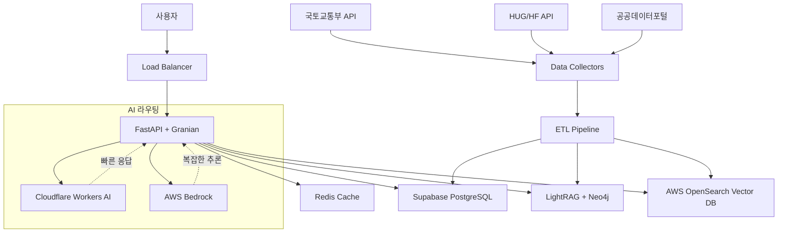

# BODA (BOoDongSan AI Chatbot) | 보다 (한국 부동산 RAG AI 챗봇)

> **BODA** stands for **BO**o**D**ongSan **A**I - Korean Real Estate RAG AI Chatbot

한국 부동산 시장을 위한 RAG 기반 AI 추천 챗봇

## 🚀 **QUICK START (5분 설치)**

**Required**: Docker, Python 3.11+, 그리고 AWS 계정

### **1단계: 프로젝트 설정**
```bash
git clone <your-repo-url>
cd boodongsan/backend
cp .env.example .env
```

### **2단계: 필수 환경변수 입력** 
`.env` 파일에서 다음 항목만 입력하세요:
```bash
# AWS Bedrock (필수)
AWS_ACCESS_KEY_ID=your_aws_access_key
AWS_SECRET_ACCESS_KEY=your_aws_secret_key

# OpenSearch (필수)
OPENSEARCH_HOST=search-your-domain.ap-northeast-2.es.amazonaws.com
OPENSEARCH_INDEX_NAME=boda_vectors

# Supabase (필수)
SUPABASE_URL=your_supabase_url
SUPABASE_ANON_KEY=your_supabase_anon_key
SUPABASE_SERVICE_ROLE_KEY=your_supabase_service_role_key

# Cloudflare Workers AI (필수)
CLOUDFLARE_ACCOUNT_ID=your_cloudflare_account_id
CLOUDFLARE_API_TOKEN=your_cloudflare_api_token

# 국토교통부 API (필수)
MOLIT_API_KEY=your_molit_api_key

# Seoul Open Data (선택)
# SEOUL_OPEN_API_KEY=sample
```

### **3단계: Docker로 실행**
```bash
# 모든 백엔드 컴포넌트 시작 (Redis, Neo4j, Backend)
docker-compose up -d

# 로그 확인
docker-compose logs -f backend
```

### **4단계: 접속 확인**  
- **API 서버**: http://localhost:8000
- **API 문서**: http://localhost:8000/docs  
- **헬스체크**: http://localhost:8000/api/v1/health

### **🆘 문제 해결**
```bash
# 서비스 중지
docker-compose down

# 전체 재시작
docker-compose down -v && docker-compose up -d

# 개별 서비스 재시작  
docker-compose restart backend
```

---

## 🎯 프로젝트 개요

이 프로젝트는 한국 부동산 데이터와 정부 정책 정보를 학습하여 사용자에게 맞춤형 부동산을 추천하는 RAG(Retrieval Augmented Generation) 기반 AI 챗봇입니다.

### 주요 기능
- 🏠 한국 부동산 매물 검색 및 추천
- 🏛️ 정부 지원 정책 매칭 (HUG, LH, 전세대출 등)
- 💬 자연어 기반 대화형 인터페이스
- 📊 실거래가 데이터 기반 시장 분석
- 🔍 지역별/조건별 맞춤 검색
- 📡 서울시 실시간 도시데이터 연동 (인구·교통·날씨)

## 🏗️ 시스템 아키텍처

### 고수준 아키텍처


### 데이터 플로우
```
사용자 질문 → FastAPI → Redis 캐시 확인 → LightRAG(Neo4j) 그래프 검색 → (필요 시 AWS OpenSearch 벡터 검색) → 컨텍스트 구성 → AI 모델 선택 → 응답 생성 → 캐시 저장 → 사용자 응답
```

### 컴포넌트 역할
- **FastAPI**: RESTful API 엔드포인트 및 비즈니스 로직
- **Uvicorn**: ASGI 서버 (Python 기반)
- **LightRAG + Neo4j**: 지식 그래프 기반 검색
- **AWS OpenSearch**: 벡터 유사도 검색 (LightRAG 실패 시 보조)
- **Supabase**: 부동산 메타데이터 및 사용자 데이터 (연결 풀링, retry 로직)
- **Redis**: 응답 캐싱 및 세션 관리 (계층화된 캐싱)
- **AI 라우팅**: 질문 복잡도에 따른 적응형 모델 선택 (circuit breaker, failover)
- **Reliability Layer**: 자동 재시도, 오류 복구, 성능 모니터링

## 🔧 기술 스택

### Backend
- **Web Framework**: FastAPI + Uvicorn (ASGI Server)
- **Vector Database**: AWS OpenSearch
- **Primary Database**: Supabase PostgreSQL
- **Cache**: Redis
- **AI/LLM**: 
  - AWS Bedrock + LangChain (Complex reasoning)
  - Cloudflare Workers AI (Primary chatbot interactions)
- **Reliability**: Circuit Breaker, Retry Logic, Failover
- **Monitoring**: Performance metrics, Health checks
- **Validation**: Pydantic models, Input validation

### Data Sources
- 국토교통부 실거래가 API
- HUG/HF 정부 정책 API
- 공공데이터포털 부동산 데이터

## 📋 최적화된 프로젝트 구조

```
boodongsan/
├── backend/                # 모든 백엔드 관련 파일
│   ├── api/               # FastAPI 애플리케이션
│   │   ├── main.py        # FastAPI 메인 앱
│   │   ├── routers/       # API 라우터
│   │   └── middleware/    # 미들웨어
│   ├── core/              # 핵심 설정 (최적화됨)
│   │   ├── config.py      # 환경 설정 (Pydantic 검증)
│   │   ├── database.py    # DB 연결 (연결 풀링, retry)
│   │   └── exceptions.py  # 구조화된 예외 처리
│   ├── models/            # 데이터 모델
│   │   ├── property.py    # 부동산 모델
│   │   └── user.py        # 사용자 모델
│   ├── services/          # 비즈니스 로직 (엔터프라이즈급)
│   │   ├── rag_service.py # RAG 처리 (캐싱, 재시도)
│   │   ├── opensearch_service.py # AWS OpenSearch 벡터 검색
│   │   └── ai_service.py  # AI 서비스 (failover, circuit breaker)
│   ├── ai/                # AI 관련 모듈 (예: bedrock_client.py)
│   ├── api/               # FastAPI 라우터 및 미들웨어
│   ├── core/              # 환경설정, 데이터베이스 헬퍼, 예외 정의
│   ├── data/              # 데이터 처리 / 수집 스크립트
│   ├── docs/              # 백엔드 문서
│   ├── migrations/        # Supabase / LightRAG SQL 스키마
│   ├── services/          # LightRAG, DataService, AIService 등 비즈니스 로직
│   ├── .env.example       # 환경 변수 예제
│   ├── docker-compose.yml # Docker 컨테이너 설정
│   ├── Dockerfile         # Docker 이미지 빌드
│   ├── pyproject.toml     # uv 패키지 관리
│   ├── requirements.txt   # Python 의존성 (호환성)
│   └── uv.lock           # uv 잠금 파일
├── .gitignore            # Git 무시 파일
├── LICENSE               # 프로젝트 라이선스
├── README.md             # 프로젝트 개요
├── DEPLOYMENT.md         # 배포 가이드
└── PROJECT_COMPLETION_ROADMAP.md # 프로젝트 로드맵
```

## 💻 **설치 방법**

### **Method 1: Docker (권장 - 5분 설치)**
위의 [QUICK START](#-quick-start-5분-설치) 섹션을 따라하세요.

### **Method 2: 로컬 Python 개발환경**
```bash
# 1. 프로젝트 클론 및 환경설정
git clone <your-repo-url> 
cd boodongsan/backend
cp .env.example .env
# .env 파일에 필수 API 키들 입력 (Quick Start 참조)

# 2. uv로 Python 환경 설정 (권장)
uv sync

# 또는 pip 사용
python -m venv venv
source venv/bin/activate  # Windows: venv\Scripts\activate  
pip install -r requirements.txt

# 3. 외부 서비스 시작 (Redis, Neo4j)
docker-compose up -d redis neo4j

# 4. 개발 서버 시작
uv run uvicorn api.main:app --host 0.0.0.0 --port 8000 --reload
```

### **Method 3: Production 배포**
AWS/클라우드 배포는 [DEPLOYMENT.md](DEPLOYMENT.md) 참조

---

## ⚠️ **중요 보안 알림**
- **절대로 `.env` 파일을 Git에 커밋하지 마세요**
- **프로덕션에서는 모든 API 키를 새로 생성하세요**
- **JWT 시크릿 키를 정기적으로 교체하세요**

## 🔧 API 사용법

### 기본 챗봇 대화
```bash
curl -X POST "http://localhost:8000/chat" \
  -H "Content-Type: application/json" \
  -H "Authorization: Bearer YOUR_JWT_TOKEN" \
  -d '{
    "message": "강남구에 3억 이하 아파트 추천해줘",
    "user_id": "user123",
    "conversation_id": "conv_456"
  }'

# 응답 예시
{
  "response": "강남구에서 3억 이하 아파트를 찾아드렸습니다. 현재 5개 매물이 있으며...",
  "properties": [
    {
      "id": "prop_123",
      "address": "서울시 강남구 역삼동 123-45",
      "price": 280000000,
      "room_count": 3,
      "area_m2": 84.3,
      "building_year": 2018
    }
  ],
  "suggested_policies": ["신혼부부 특별공급"],
  "confidence_score": 0.87,
  "search_time_ms": 234
}

# 에러 응답 예시
{
  "error": {
    "code": "INVALID_LOCATION",
    "message": "지원하지 않는 지역입니다",
    "details": "현재 서울, 경기, 인천만 지원합니다"
  }
}
```

### 부동산 검색
```bash
curl -X POST "http://localhost:8000/search/properties" \
  -H "Content-Type: application/json" \
  -d '{
    "query": "신혼부부 전세 지원 가능한 아파트",
    "filters": {
      "max_price": 300000000,
      "location": "서울시 강남구",
      "room_count": 3
    }
  }'
```

### 정부 정책 조회
```bash
curl -X POST "http://localhost:8000/policies/match" \
  -H "Content-Type: application/json" \
  -d '{
    "user_profile": {
      "age": 28,
      "income": 40000000,
      "is_married": true,
      "is_first_time_buyer": true
    }
  }'
```

### 실시간 도시 데이터
```bash
curl "http://localhost:8000/api/v1/citydata?location=광화문·덕수궁"

# 또는 장소 코드 사용 (예: POI009)
curl "http://localhost:8000/api/v1/citydata?area_code=POI009"

# 실시간 인구 전용 (OA-21778)
curl "http://localhost:8000/api/v1/citydata/population?location=광화문·덕수궁"

# 실시간 상권 전용 (OA-22385)
curl "http://localhost:8000/api/v1/citydata/commercial?area_code=POI009"
```

## 📊 데이터 소스

### 부동산 실거래가 데이터
- **국토교통부 실거래가 공개 시스템**
- **아파트/오피스텔/연립/단독 매매/전월세**
- **업데이트**: 월 1-2회

### 정부 정책 데이터
- **HUG 전세보증보험 정보**
- **주택금융공사(HF) 대출 상품**
- **LH 청약 정보**
- **지자체별 주거 지원 정책**

### 생활 인프라 데이터
- **교통**: 지하철역, 버스정류장 접근성
- **교육**: 학교, 학원가 정보
- **편의시설**: 마트, 병원, 공원 정보
- **실시간 도시데이터**: 서울 120개 권역 인구·교통·날씨 스냅샷 (OA-21285)
- **실시간 인구/상권 데이터**: 서울시 실시간 인구 (OA-21778), 실시간 상권현황 (OA-22385)

## 🤖 RAG 파이프라인

### 1. 데이터 수집 및 전처리
```python
# 실거래가 데이터 수집
python backend/data/collectors/real_estate_collector.py

# 정부 정책 데이터 수집  
python backend/data/collectors/policy_collector.py

# 데이터 정제 및 통합
python backend/data/processors/data_processor.py
```

### 2. 임베딩 생성
```python
# 부동산 정보 임베딩
python backend/data/embeddings/property_embedder.py

# 정책 정보 임베딩
python backend/data/embeddings/policy_embedder.py
```

### 3. 벡터 검색 및 응답 생성
```
사용자 질문 → LightRAG 그래프 검색 → (필요 시) AWS OpenSearch 유사도 검색 → 관련 문서 추출 → LLM 컨텍스트 → 응답 생성
```

## 🏛️ 지원 정부 정책

- **청년전세임대주택**: 만 19~39세 청년 전세 지원
- **신혼부부 특별공급**: 신혼부부 주택 우선 공급
- **생애최초 특별공급**: 무주택자 첫 주택 구입 지원
- **HUG 전세보증보험**: 전세보증금 반환 보증
- **버팀목 전세자금**: 저소득층 전세자금 대출
- **적금 연계 전세대출**: 청약통장 연계 전세대출

## 📈 성능 최적화

### 엔터프라이즈급 신뢰성
```python
# Circuit Breaker Pattern
- AI 서비스별 실패 임계값 모니터링
- 자동 failover (Bedrock ↔ Cloudflare)
- 복구 시도 및 상태 관리

# 재시도 로직 (Exponential Backoff)
- 데이터베이스 연결 오류 복구
- AI API 호출 실패 재시도
- 외부 서비스 일시적 오류 처리

# 성능 모니터링
- 실시간 응답 시간 추적
- 서비스별 성공률 모니터링
- 캐시 적중률 최적화
```

### 계층화된 캐싱 전략
```python
# Multi-level Caching
- L1: RAG 응답 캐시 (30분 TTL)
- L2: 엔티티 추출 결과 (15분 TTL)
- L3: 임베딩 벡터 캐시 (2시간 TTL)
- L4: 부동산 검색 결과 (15분 TTL)

# 지능형 캐시 무효화
- 사용자별 맞춤 캐시
- 지역별 데이터 업데이트 감지
- 정책 변경 시 자동 갱신
```

### 고급 벡터 검색
```python
# 하이브리드 검색 엔진
- 벡터 유사도 (70%) + 키워드 매칭 (30%)
- 동적 가중치 조정
- 필터링 최적화 (지역, 가격, 면적)
- 결과 re-ranking 알고리즘

# 검색 성능 최적화
- 인덱스 최적화 (HNSW 알고리즘)
- 배치 처리 벡터 생성
- 병렬 검색 처리
```

### AI 서비스 고도화
```python
# 지능형 라우팅
- 요청 복잡도 기반 모델 선택
- 실시간 성능 메트릭 반영
- 비용 최적화 라우팅

# Failover 메커니즘
- 3초 타임아웃 + 자동 재시도
- Provider 간 자동 전환
- 성능 기반 우선순위 조정

# 요청 검증 및 최적화
- 입력 크기 제한 (200K 문자)
- 컨텍스트 압축 알고리즘
- 응답 품질 점수 계산
```

## 🛡️ 보안 및 컴플라이언스

### 보안 아키텍처
- **API 인증**: JWT 기반 인증 + Rate Limiting
- **데이터 암호화**: AES-256 (저장), TLS 1.3 (전송)
- **접근 제어**: RBAC (Role-Based Access Control)
- **API 보안**: OWASP Top 10 준수, Input Validation
- **인프라 보안**: VPC, 보안 그룹, WAF

### 한국 법규 준수
- **개인정보보호법 (PIPA)**: 개인정보 수집/처리 최소화
- **부동산 거래신고법**: 실거래가 데이터 적법 사용
- **데이터 보존**: 법정 보존기간 준수 (3년)
- **감사 로그**: 모든 데이터 접근 기록 보관

### 보안 모니터링
```python
# 보안 이벤트 모니터링
- 비정상 API 호출 패턴 감지
- 개인정보 접근 로그 실시간 분석
- 취약점 스캐닝 자동화
- 보안 인시던트 알림 시스템
```

## 🚀 프로덕션 배포

### 인프라 아키텍처
```yaml
Production Environment:
  Load Balancer: AWS ALB + CloudFront CDN
  Compute: ECS Fargate (Auto Scaling 2-10 instances)
  Database: 
    - Supabase Pro (Multi-AZ)
    - Neo4j (Docker, APOC enabled)
    - Redis ElastiCache (Cluster Mode)
  Monitoring: CloudWatch + Grafana + Sentry
  CI/CD: GitHub Actions → ECR → ECS
```

### 배포 전략
```bash
# Blue-Green 배포
# 1. 새 버전을 별도 환경에 배포
# 2. 헬스체크 및 스모크 테스트
# 3. 트래픽 점진적 전환 (10% → 50% → 100%)
# 4. 롤백 준비 상시 대기

# 자동화된 배포 파이프라인
aws ecr get-login-password --region ap-northeast-2 | docker login
docker build -t korean-real-estate-rag .
docker tag korean-real-estate-rag:latest $AWS_ECR_REPO:$VERSION
docker push $AWS_ECR_REPO:$VERSION
aws ecs update-service --cluster prod --service real-estate-api
```

### 환경별 구성
- **Development**: Single instance, local Redis
- **Staging**: Production과 동일한 구성 (소규모)
- **Production**: Multi-AZ, Auto Scaling, CDN

## 📊 성능 및 모니터링

### 향상된 성능 목표 (SLA)
- **응답 시간**: 평균 400ms, 95백분위 1.2초, 99백분위 2초
- **처리량**: 2,000 req/min 지속 처리 (캐싱 최적화)
- **가용성**: 99.95% (연간 4.4시간 다운타임) - 자동 failover
- **정확도**: RAG 응답 정확도 90% 이상
- **복구 시간**: 장애 감지 후 30초 내 자동 복구
- **캐시 적중률**: 70% 이상 (응답 속도 향상)

### 종합 모니터링 대시보드
```python
# 신뢰성 메트릭
reliability_metrics = {
    "circuit_breaker_trips": "회로 차단기 동작 횟수",
    "failover_success_rate": "자동 장애 복구 성공률",
    "retry_attempts": "재시도 로직 활용률",
    "service_health_score": "서비스별 건강도 점수"
}

# 성능 메트릭
performance_metrics = {
    "api_response_time": "avg, p95, p99",
    "vector_search_latency": "LightRAG/AWS OpenSearch 검색 시간",
    "ai_model_latency": "LLM 응답 생성 시간", 
    "cache_hit_rate": "다층 캐시 적중률",
    "error_rate": "5xx 에러율 (< 0.05%)",
    "concurrent_users": "동시 활성 사용자",
    "data_freshness": "실거래가 데이터 최신성"
}

# AI 서비스 메트릭
ai_metrics = {
    "provider_availability": "Bedrock vs Cloudflare 가용성",
    "model_selection_accuracy": "적응형 라우팅 정확도",
    "context_compression_ratio": "컨텍스트 압축 효율성",
    "confidence_score_distribution": "응답 신뢰도 분포"
}
```

### 향상된 알림 체계
- **Critical**: 
  - 에러율 > 0.5% (5분간)
  - 응답시간 > 2초 (p99)
  - Circuit breaker 열림
  - AI 서비스 완전 장애
- **Warning**: 
  - 캐시 적중률 < 70%
  - Failover 이벤트 발생
  - 재시도 횟수 급증
  - 데이터베이스 연결 지연
- **Info**: 
  - 자동 복구 성공
  - 성능 개선 감지
  - 데이터 업데이트 완료
  - 배포 성공

### 고급 로깅 전략
```python
# 구조화된 로깅 (JSON) + 신뢰성 메트릭
{
    "timestamp": "2024-01-01T00:00:00Z",
    "level": "INFO",
    "service": "rag-service", 
    "correlation_id": "rag_1704067200123",
    "user_id": "hashed_user_id",
    "query_type": "property_search",
    
    # 성능 메트릭
    "timings": {
        "vector_search_ms": 45,
        "ai_generation_ms": 234,
        "cache_lookup_ms": 3,
        "total_response_ms": 892
    },
    
    # 신뢰성 메트릭
    "reliability": {
        "ai_provider": "bedrock",
        "retry_count": 0,
        "circuit_breaker_state": "closed",
        "cache_hit": true,
        "confidence_score": 0.89
    },
    
    # 추적 정보
    "trace": {
        "stage_timings": {
            "load_user_context_ms": 12,
            "extract_entities_ms": 67,
            "vector_search_ms": 45,
            "generate_response_ms": 234
        }
    }
}
```

## 🆘 장애 대응 및 복구

### 자동화된 장애 복구
1. **자동 복구 (Level 1)**: Circuit Breaker, Health Check, Retry Logic
2. **서비스 복구 (Level 2)**: 자동 failover, 대체 서비스 활성화
3. **수동 대응 (Level 3)**: 온콜 엔지니어 5분 내 대응
4. **데이터 복구 (Level 4)**: 일일 자동 백업, 시점 복구 가능
5. **재해 복구 (Level 5)**: Multi-Region 백업 (RTO: 4시간, RPO: 1시간)

### 실시간 모니터링
```python
# 핵심 안정성 메트릭
reliability_metrics = {
    "circuit_breaker_status": "AI 서비스별 회로 차단기 상태",
    "failover_events": "자동 장애 복구 이벤트",
    "retry_success_rate": "재시도 로직 성공률",
    "service_availability": "서비스별 가용성 (99.9% 목표)",
    "response_time_p99": "99% 응답 시간 (<2초)",
    "error_recovery_time": "오류 복구 시간 (<30초)"
}
```

### 백업 전략
```bash
# PostgreSQL 백업 (일일)
pg_dump --host=$SUPABASE_HOST --dbname=postgres > backup_$(date +%Y%m%d).sql

# Neo4j 그래프 백업 (주간)
qdrant-client backup --collection real-estate --output s3://backups/vectors/

# Redis 백업 (실시간 복제)
redis-cli --rdb backup.rdb
```

## 🧪 테스트

### 단위 테스트 실행
```bash
pytest tests/unit/
```

### 통합 테스트 실행  
```bash
pytest tests/integration/
```

### API 테스트
```bash
pytest tests/api/
```

### 성능 테스트
```bash
# API 응답 시간 테스트
pytest tests/performance/ --benchmark-only

# 벡터 검색 성능 테스트
python tests/performance/vector_search_benchmark.py
```

### 부하 테스트
```bash
# Locust를 사용한 부하 테스트
pip install locust
locust -f tests/load/locustfile.py --host=http://localhost:8000
```

## 🤝 기여 가이드라인

### 개발 환경 설정
```bash
# 개발 브랜치 생성
git checkout -b feature/new-feature

# 코드 스타일 검사
black backend/
flake8 backend/
mypy backend/

# 테스트 실행
pytest tests/ --cov=backend --cov-report=html
```

### Pull Request 프로세스
1. **이슈 생성**: 기능 요청 또는 버그 리포트
2. **브랜치 생성**: `feature/`, `bugfix/`, `hotfix/` 접두사 사용
3. **코드 작성**: 테스트 포함, 문서 업데이트
4. **코드 리뷰**: 최소 2명 승인 필요
5. **CI/CD 통과**: 모든 테스트 및 보안 스캔 통과

### 코드 품질 기준
- **테스트 커버리지**: 최소 80%
- **코드 복잡도**: Cyclomatic complexity < 10
- **보안 스캔**: Bandit, Safety 통과
- **성능**: 새 기능은 기존 성능 대비 10% 이내 영향

## 📄 라이선스

이 프로젝트는 MIT 라이선스 하에 배포됩니다. 자세한 내용은 [LICENSE](LICENSE) 파일을 참조하세요.

## 📞 문의 및 지원

- **이슈 제기**: [GitHub Issues](https://github.com/yourusername/korean-real-estate-rag/issues)
- **기능 요청**: [Feature Requests](https://github.com/yourusername/korean-real-estate-rag/discussions)
- **보안 취약점**: security@yourcompany.com
- **일반 문의**: contact@yourcompany.com

## 📝 개발 로드맵

### Phase 1: 기본 RAG 시스템 ✅
- [x] FastAPI + Granian 설정
- [x] LightRAG + Neo4j 그래프 연동
- [x] 기본 임베딩 파이프라인
- [x] 간단한 챗봇 인터페이스

### Phase 2: 백엔드 최적화 ✅
- [x] 데이터베이스 연결 관리 및 retry 로직
- [x] AI 서비스 failover 및 circuit breaker
- [x] RAG 서비스 성능 최적화 및 캐싱
- [x] 벡터 서비스 하이브리드 검색
- [x] 구조화된 예외 처리 시스템
- [x] 종합적인 설정 검증

### Phase 3: 프로덕션 준비 (진행중)
- [x] 모니터링 및 로깅 시스템
- [x] 에러 핸들링 강화
- [x] 성능 최적화 및 캐싱
- [ ] 국토교통부 API 연동
- [ ] 정부 정책 데이터 수집
- [ ] 데이터 품질 검증
- [ ] 자동 업데이트 스케줄링

### Phase 4: AI 고도화
- [ ] 컨텍스트 인식 대화
- [ ] 사용자 프로파일 학습
- [ ] 개인화된 추천 알고리즘
- [ ] 다중 턴 대화 지원
